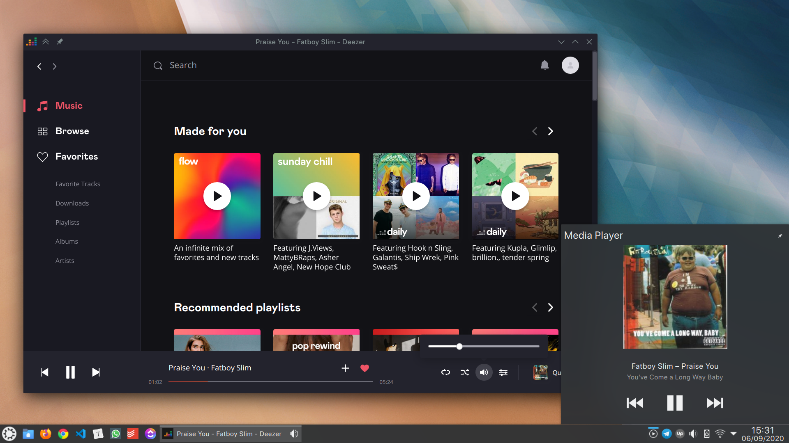

# Deezer Ubuntu build script



Unofficial script to install Deezer desktop on Ubuntu. Based on [the AUR Script by SibrenVasse](https://aur.archlinux.org/packages/deezer/).

For Windows, Deezer distributes a version of the Electron run time (Windows binary) and the source code of their application itself. The build process of this package extracts the application source from the Windows installer.

This package applies several patches for:

- Compatibility with newer Electron versions
- Compatibility with a Linux environment in general.
- Fixing bugs

## Options

You can start Deezer minimized on the tray using the `--start-in-tray` flag;

```bash
deezer --start-in-tray
```

## Building

To install on Ubuntu:

```bash
git clone https://github.com/siphomateke/deezer
cd deezer
chmod +x ./install.sh
./install.sh
```

The Deezer Windows installer will then be downloaded, extracted and patched to work for Linux. When prompted for your sudo password, please enter it.

## Debugging

Running the application from the command line will show verbose logging.

```bash
deezer
```

To run the application with devtools by running

```bash
env DZ_DEVTOOLS=yes electron /usr/share/deezer/app.asar
```

To debug node, you can extract the source files to a directory and inspect the node process by attaching using the chromium debugging tools. (<https://www.electronjs.org/docs/tutorial/debugging-main-process>)

```bash
asar extract /usr/share/deezer/app.asar $dest
electron --inspect-brk=$port $dest
```
